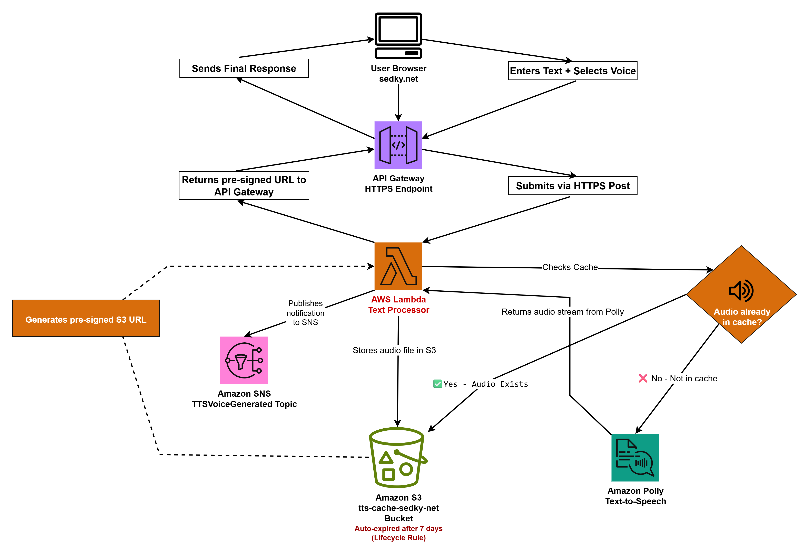

# 🗣️ Text-to-Speech Converter Using AWS Lambda, Polly, S3 Caching, and Pre-Signed URLs

This project implements a fully serverless text-to-speech conversion system using AWS Lambda, Amazon Polly, S3 for caching, and SNS for notification. Users enter text and select a voice via a frontend interface hosted on sedky.net. Lambda handles voice synthesis, checks for existing audio cache in S3, generates new audio with Polly if necessary, and returns a pre-signed download URL.

---

## 📑 Table of Contents
- Architecture Overview
- Problem This Solves
- Live Demo
- How It Was Built
- Business Impact
- Cost & Security Considerations
- Well-Architected Framework Alignment
- Challenges & Solutions
- Screenshots
- Project Structure
- Contact

---

## 🧭 Architecture Overview

This architecture uses:
- ✅ Amazon API Gateway (HTTPS interface)
- ✅ AWS Lambda (orchestration logic)
- ✅ Amazon Polly (text-to-speech engine)
- ✅ Amazon S3 (MP3 file cache + lifecycle policy)
- ✅ Amazon SNS (notification on audio generation)



---

## 🚩 Problem This Solves

Converting text to voice dynamically is costly if done repeatedly. This project:
- Implements **audio caching** using hashed S3 keys
- Avoids duplicate Polly charges
- Reduces latency with pre-signed S3 URLs
- Provides real-time feedback and downloadable voice output

---

## 🌍 Live Demo

🔗 [Try the Live TTS Converter on sedky.net](https://sedky.net#text-to-speech)

- Enter your text (up to 500 characters)
- Select a voice
- Convert and download/play the result

---

## 🔧 How It Was Built

- Python-based Lambda function using `boto3`
- Polly engine selection (standard vs. neural)
- MP3 file key derived from `SHA-256(voice + text)`
- Cached files stored in S3, auto-expire after 7 days
- SNS notification publishes on successful generation
- Pre-signed URLs returned via API Gateway to the frontend

---

## 💼 Business Impact

✅ Reduces repeated voice synthesis costs via caching  
✅ Enables downloadable voice content on-demand  
✅ Demonstrates a real-world, scalable serverless application  
✅ Can be adapted for accessibility tools, IVR, or podcast automation

---

## 💰 Cost & 🔐 Security Considerations

- **Amazon Polly**: Billed per character (within Free Tier limits)
- **Amazon S3**: Minimal cost, MP3s auto-expire in 7 days
- **Lambda & API Gateway**: Serverless, usage-based pricing
- **Security**:
  - S3 objects are private and accessed only via pre-signed URLs
  - IAM roles follow least-privilege principles
  - API Gateway includes throttling and CORS headers
  - No secrets hardcoded; all logic handled via environment configs

---

## ✅ Well-Architected Framework Alignment

| Pillar               | Implementation Notes                                      |
|----------------------|-----------------------------------------------------------|
| Security             | IAM least privilege, private S3 with pre-signed URLs      |
| Reliability          | Caching layer minimizes external service calls            |
| Performance          | Pre-signed URLs + S3 read path = fast delivery            |
| Cost Optimization    | Avoids redundant Polly calls with deterministic caching   |
| Operational Excellence | Monitored via logs, future lifecycle automation ready   |

---

## 🛠 Challenges & Solutions

| Challenge                                 | Solution                                             |
|------------------------------------------|------------------------------------------------------|
| Preventing duplicate audio generation     | Used SHA-256 hash on (voice + text) as unique key   |
| Avoiding hardcoded credentials            | Used Lambda environment and IAM role permissions    |
| Long text or invalid input                | Limited input to 500 characters, sanitized input    |
| Polly cost concerns                       | Cache layer avoids repeated synthesis calls         |
| Cross-origin frontend integration         | CORS headers configured in Lambda response          |

---

## 🖼 Screenshots

| Screenshot File Name                         | Description                        |
|----------------------------------------------|------------------------------------|
| 01-Lambda-Polly-Execution-Role.png           | IAM Policy used by Lambda          |
| 02-lambda-execution-role-summary-permissions.png | Lambda role permissions         |
| 03-lambda-execution-role-summary-trust-relationship.png | Trust policy                |
| 04-lambda-function-summary.png               | Lambda function configuration      |
| 05-lambda-function-code.png                  | Python code inside Lambda          |
| 06-lambda-function-successful-test.png       | Lambda test result (success)       |
| 07-api-gateway-http-api-created.png          | API Gateway configuration          |
| 08-api-gateway-successful-response.png       | Test response (pre-signed URL)     |
| 09-s3-tts-cache-creation.png                 | S3 bucket for MP3 cache            |

---

## 📁 Project Structure

```
aws-tts-lambda-cache/
├── lambda_function.py
├── architecture/
│   └── 00-tts-architecture-diagram.png
├── screenshots/
│   └── [All 01–09 PNGs listed above]
├── LICENSE
├── README.md
```

---

## 📬 Contact

- 🌐 Portfolio – [Sedky.net](https://sedky.net)
- 💼 LinkedIn – [Omar Sedky](https://linkedin.com/in/omarsedky)
- 💻 GitHub – [@oSedky](https://github.com/oSedky)
- ✉️ Email – omar@sedky.net
